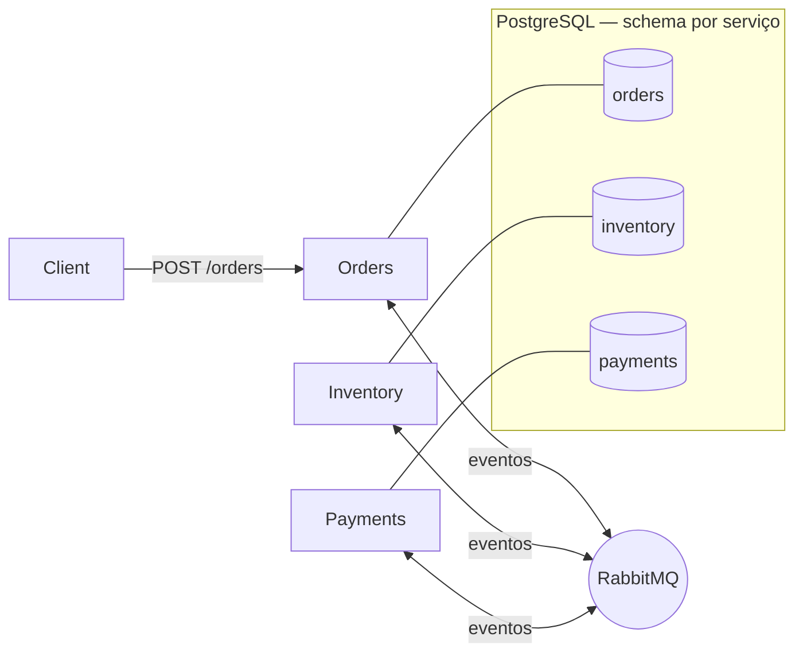
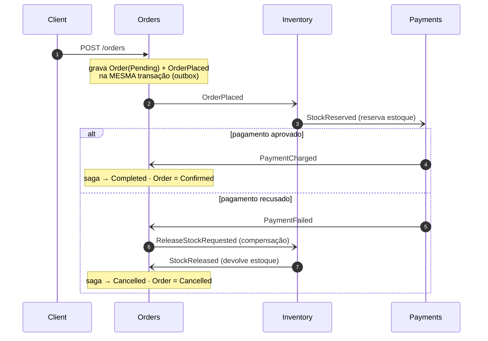

# distributed-consistency-lab

> Consistência entre serviços **sem 2PC** — provada por testes, não por afirmação.

Um lab focado que mostra, com código executável, como garantir que uma operação
de negócio que cruza três serviços chegue a um estado final consistente **mesmo
quando o message broker cai no meio do caminho**.

Os três pilares: **Transactional Outbox** (publicação atômica), **Inbox**
(consumo idempotente) e **Saga** (coordenação com compensação) — implementados
à mão sobre RabbitMQ + PostgreSQL para expor a mecânica que frameworks escondem.

[](https://github.com/thomasmoreira/distributed-consistency-lab/actions/workflows/ci.yml)

---

## A tese

`db.Save(); broker.Publish();` é o anti-padrão **dual-write**: se o processo
morre entre as duas linhas, estado e evento divergem para sempre. Transação
distribuída ACID (2PC) não escala e o RabbitMQ não participa dela na prática.

A resposta de produção é **consistência eventual confiável**:

- O evento é gravado na tabela `outbox` na **mesma transação** que muda o estado → sem dual-write.
- Um dispatcher publica do outbox e só marca como enviado após *publisher confirm*.
- O consumidor é **idempotente** via tabela `inbox` (PK = message-id) → **exactly-once-effect**, mesmo com o at-least-once do broker.
- A Saga coordena o fluxo multi-serviço e **compensa** quando um passo falha.

## Domínio de exemplo — checkout

Pequeno e didático, com compensação natural:

`OrderPlaced` → `ReserveStock` → `ChargePayment` → `OrderConfirmed`
Se o pagamento falha: `PaymentFailed` → `ReleaseStock` (compensação) → `OrderCancelled`

## Arquitetura (C4 — container)



| Serviço     | Tipo   | Responsabilidade                                            |
|-------------|--------|------------------------------------------------------------|
| `Orders`    | API    | Cria o pedido; hospeda a `OrderSaga` (orquestração)         |
| `Inventory` | Worker | Reserva / libera estoque                                    |
| `Payments`  | Worker | Cobra / estorna pagamento                                   |

## Fluxo da saga (sequência)

Cada `-)` é um evento assíncrono que viaja pelo RabbitMQ (publicado via outbox,
consumido via inbox). Tudo entre o estado e o evento commita na mesma transação local.



## Garantias provadas (Failure Modes)

O coração do lab: cada garantia tem um teste que sobe RabbitMQ + PostgreSQL reais
via Testcontainers. Nada é prometido sem prova.

| Garantia                                            | Como é provada                                              | Teste |
|-----------------------------------------------------|-------------------------------------------------------------|-------|
| Sem **dual-write** (estado + evento atômicos)       | Order + OrderPlaced numa única transação                    | `PlaceOrderTests` |
| **F1** — broker indisponível, nada se perde         | broker congelado → OrderPlaced fica no outbox → publica ao voltar | `EndToEndResilienceTests` |
| **Exactly-once-effect** no consumo (redelivery)     | a mesma mensagem entregue 2× produz o efeito 1× (inbox)     | `InboxProcessorTests`, `RabbitMqConsumerHostTests` |
| Reserva / cobrança **idempotentes**                 | redelivery → reserva/cobra exatamente 1×                    | `InventoryReserveStockTests`, `PaymentsChargeTests` |
| **Compensação** (pagamento falha)                   | falha → libera o estoque reservado → cancela o pedido       | `OrderSagaOrchestrationTests`, `InventoryReserveStockTests` |
| **Exactly-once end-to-end**                         | o checkout completo nos 3 serviços conclui exatamente 1×    | `EndToEndResilienceTests` |
| Saga em **2 estilos** com o mesmo desfecho          | orquestração e coreografia chegam ao mesmo resultado        | `OrderSagaOrchestrationTests`, `ChoreographyCoordinatorTests` |

> A indisponibilidade do broker é simulada com `docker pause`/`unpause` (congela o
> processo sem fechar conexões nem perder dados) — ver as notas de engenharia no
> commit da fase de resiliência.

**Trade-offs assumidos** (ver [`docs/adr/`](docs/adr)):
- Mensageria **caseira** em vez de MassTransit — para expor a mecânica ([ADR-004](docs/adr/ADR-004-handrolled-messaging.md)).
- **Schema por serviço** num único Postgres em vez de banco por serviço ([ADR-005](docs/adr/ADR-005-schema-per-service.md)).

### Em produção eu usaria MassTransit, e por quê

MassTransit já entrega Outbox, retry com backoff, sagas e deduplicação testados
em escala. Reimplementar isso à mão **em produção** seria reinventar a roda. Aqui
foi proposital: o objetivo é entender o que o framework faz por baixo — quando
você sabe a mecânica, sabe configurar e debugar o framework.

## Saga: dois estilos lado a lado

O mesmo checkout aparece em **orquestração** (coordenador central com máquina de
estados persistida, em `src/Services/Orders`) e **coreografia** (reações sem estado
central, em `src/choreography`). Inventory e Payments são idênticos nos dois estilos —
só a coordenação do Orders muda. Comparação em
[ADR-003](docs/adr/ADR-003-saga-orchestration-and-choreography.md) e
[ADR-006](docs/adr/ADR-006-orchestration-vs-choreography.md).

## Como rodar

**Pré-requisitos:** .NET 10 SDK e Docker.

```bash
# stack completo (RabbitMQ + Postgres + os 3 serviços) — POST /orders percorre o fluxo
docker compose -f docker/docker-compose.yml up --build
# em outro terminal:
curl -X POST localhost:8080/orders \
  -H "Content-Type: application/json" \
  -d '{"sku":"SKU-1","quantity":2,"amount":100}'

# testes — sobem seus próprios containers descartáveis via Testcontainers
dotnet test
```

> Os testes de integração **não** usam o docker-compose: cada teste sobe containers
> próprios (Postgres/RabbitMQ) para isolar o cenário. Rodam sequencialmente.

## Estrutura

```
src/
  BuildingBlocks/
    Messaging/      IOutbox, IInbox, dispatcher, transporte RabbitMQ
    Persistence/    DbContext base, UoW, entidades outbox/inbox
  Contracts/        eventos de integração versionados
  Services/
    Orders/         API + OrderSaga (orquestração)
    Inventory/      worker
    Payments/       worker
  choreography/     variante de coreografia do Orders (sem estado central)
tests/
  Unit/             máquina de estados da saga
  Integration/      Testcontainers — outbox/inbox, reserva, cobrança, saga,
                    resiliência (F1) + exactly-once E2E, coreografia
docs/adr/           decisões de arquitetura (ADR-001..006)
```

## Decisões de arquitetura

- [ADR-001 — Transactional Outbox](docs/adr/ADR-001-transactional-outbox.md)
- [ADR-002 — Inbox / consumo idempotente](docs/adr/ADR-002-inbox-idempotent-consumer.md)
- [ADR-003 — Saga: orquestração e coreografia](docs/adr/ADR-003-saga-orchestration-and-choreography.md)
- [ADR-004 — Mensageria caseira](docs/adr/ADR-004-handrolled-messaging.md)
- [ADR-005 — Schema por serviço](docs/adr/ADR-005-schema-per-service.md)
- [ADR-006 — Orquestração vs coreografia](docs/adr/ADR-006-orchestration-vs-choreography.md)

---

_Lab de portfólio. Foco: sistemas distribuídos, consistência eventual, design para falha._
