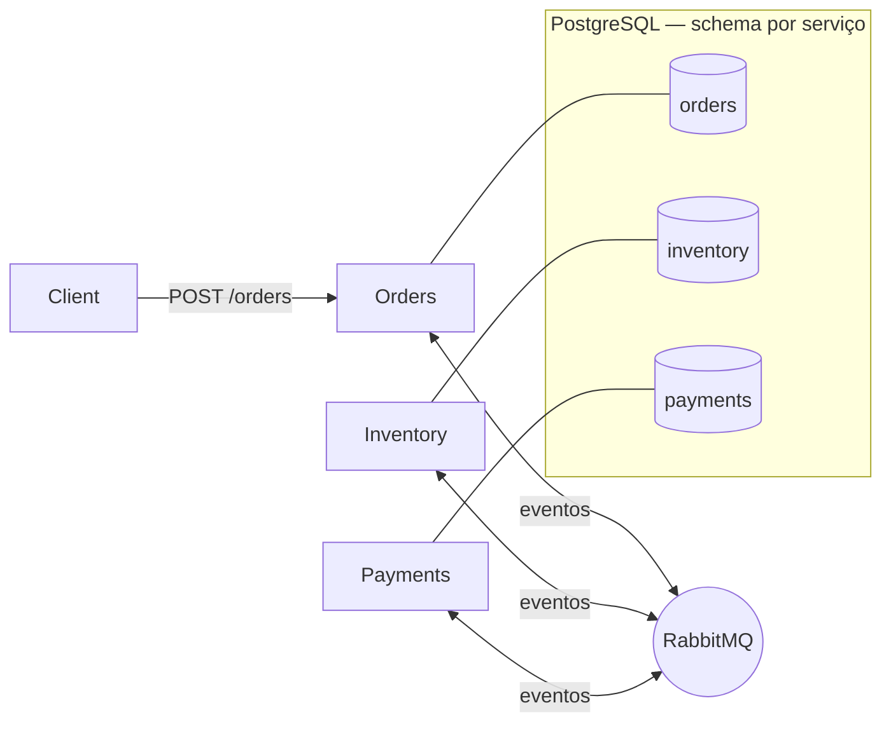
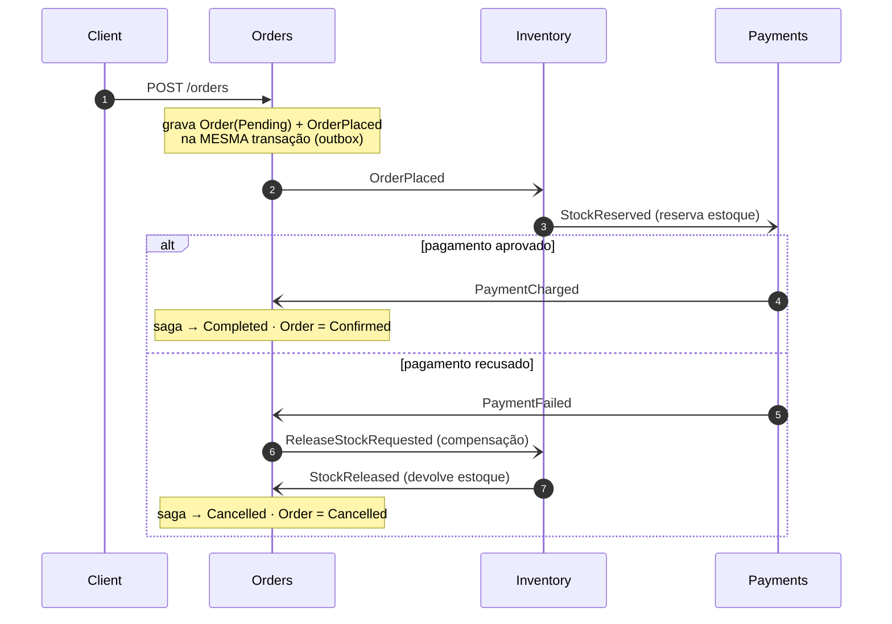

# distributed-consistency-lab

Implementação dos padrões de consistência entre serviços sem transação distribuída (2PC): Transactional Outbox, Inbox (consumo idempotente) e Saga (com compensação), construídos à mão sobre RabbitMQ e PostgreSQL. A ideia é expor a mecânica que frameworks de mensageria normalmente escondem, com testes que sobem broker e banco reais para validar cada garantia.

[](https://github.com/thomasmoreira/distributed-consistency-lab/actions/workflows/ci.yml)

## O problema

`db.Save(); broker.Publish();` é o anti-padrão dual-write: se o processo morre entre as duas linhas, estado e evento divergem permanentemente. Transação distribuída ACID (2PC) não escala, e o RabbitMQ não participa dela na prática.

A abordagem usada aqui é a consistência eventual confiável:

- O evento é gravado na tabela `outbox` na mesma transação que altera o estado, o que elimina o dual-write.
- Um dispatcher publica a partir do outbox e só marca como enviado após o publisher confirm.
- O consumidor é idempotente via tabela `inbox` (PK = message-id), garantindo efeito exactly-once mesmo com a entrega at-least-once do broker.
- A Saga coordena o fluxo entre serviços e executa a compensação quando um passo falha.

## Domínio de exemplo

Um checkout, escolhido por ter compensação natural:

`OrderPlaced → ReserveStock → ChargePayment → OrderConfirmed`
Quando o pagamento falha: `PaymentFailed → ReleaseStock → OrderCancelled`

## Arquitetura



| Serviço     | Tipo   | Responsabilidade                                    |
|-------------|--------|-----------------------------------------------------|
| `Orders`    | API    | Cria o pedido; hospeda a `OrderSaga` (orquestração) |
| `Inventory` | Worker | Reserva e libera estoque                            |
| `Payments`  | Worker | Cobra e estorna pagamento                           |

## Fluxo da saga

Cada `-)` é um evento assíncrono que viaja pelo RabbitMQ (publicado via outbox, consumido via inbox). O estado local e o evento sempre commitam na mesma transação.



## Garantias e testes

Cada garantia tem um teste que sobe RabbitMQ e PostgreSQL reais via Testcontainers.

| Garantia                                        | Como é validada                                                   | Teste |
|-------------------------------------------------|-------------------------------------------------------------------|-------|
| Sem dual-write (estado + evento atômicos)       | Order + OrderPlaced numa única transação                          | `PlaceOrderTests` |
| Broker indisponível, nada se perde              | broker congelado → OrderPlaced fica no outbox → publica ao voltar | `EndToEndResilienceTests` |
| Exactly-once-effect no consumo (redelivery)     | a mesma mensagem entregue 2× produz o efeito 1× (inbox)           | `InboxProcessorTests`, `RabbitMqConsumerHostTests` |
| Reserva e cobrança idempotentes                 | redelivery → reserva/cobra exatamente 1×                          | `InventoryReserveStockTests`, `PaymentsChargeTests` |
| Compensação quando o pagamento falha            | falha → libera o estoque reservado → cancela o pedido             | `OrderSagaOrchestrationTests`, `InventoryReserveStockTests` |
| Exactly-once end-to-end                         | o checkout completo nos 3 serviços conclui exatamente 1×          | `EndToEndResilienceTests` |
| Saga em 2 estilos com o mesmo desfecho          | orquestração e coreografia chegam ao mesmo resultado              | `OrderSagaOrchestrationTests`, `ChoreographyCoordinatorTests` |

A indisponibilidade do broker é simulada com `docker pause`/`unpause`, que congela o processo sem fechar as conexões nem perder dados.

Os trade-offs estão em [`docs/adr/`](docs/adr):

- Mensageria implementada à mão em vez de MassTransit, para expor a mecânica ([ADR-004](docs/adr/ADR-004-handrolled-messaging.md)).
- Schema por serviço num único Postgres em vez de banco por serviço ([ADR-005](docs/adr/ADR-005-schema-per-service.md)).

Em produção eu usaria MassTransit, que já entrega outbox, retry com backoff, sagas e deduplicação testados em escala. A implementação manual aqui é proposital: serve para entender o que o framework faz por baixo.

## Saga em dois estilos

O mesmo checkout aparece em orquestração (coordenador central com máquina de estados persistida, em `src/Services/Orders`) e em coreografia (reações sem estado central, em `src/choreography`). Inventory e Payments são idênticos nos dois estilos; muda apenas a coordenação no Orders. A comparação está em [ADR-003](docs/adr/ADR-003-saga-orchestration-and-choreography.md) e [ADR-006](docs/adr/ADR-006-orchestration-vs-choreography.md).

## Como rodar

Pré-requisitos: .NET 10 e Docker.

```bash
# stack completo (RabbitMQ + Postgres + os 3 serviços)
docker compose -f docker/docker-compose.yml up --build

# em outro terminal:
curl -X POST localhost:8080/orders \
  -H "Content-Type: application/json" \
  -d '{"sku":"SKU-1","quantity":2,"amount":100}'

# testes — cada um sobe seus próprios containers via Testcontainers
dotnet test
```

Os testes de integração não usam o docker-compose: cada teste sobe seus próprios containers (Postgres e RabbitMQ) para isolar o cenário, e rodam sequencialmente.

## Estrutura

```
src/
  BuildingBlocks/
    Messaging/      IOutbox, IInbox, dispatcher, transporte RabbitMQ
    Persistence/    DbContext base, UoW, entidades outbox/inbox
  Contracts/        eventos de integração versionados
  Services/
    Orders/         API + OrderSaga (orquestração)
    Inventory/      worker
    Payments/       worker
  choreography/     variante de coreografia do Orders (sem estado central)
tests/
  Unit/             máquina de estados da saga
  Integration/      Testcontainers: outbox/inbox, reserva, cobrança, saga,
                    resiliência e exactly-once end-to-end, coreografia
docs/adr/           decisões de arquitetura
```

## Decisões de arquitetura

- [ADR-001 — Transactional Outbox](docs/adr/ADR-001-transactional-outbox.md)
- [ADR-002 — Inbox / consumo idempotente](docs/adr/ADR-002-inbox-idempotent-consumer.md)
- [ADR-003 — Saga: orquestração e coreografia](docs/adr/ADR-003-saga-orchestration-and-choreography.md)
- [ADR-004 — Mensageria à mão](docs/adr/ADR-004-handrolled-messaging.md)
- [ADR-005 — Schema por serviço](docs/adr/ADR-005-schema-per-service.md)
- [ADR-006 — Orquestração vs coreografia](docs/adr/ADR-006-orchestration-vs-choreography.md)
